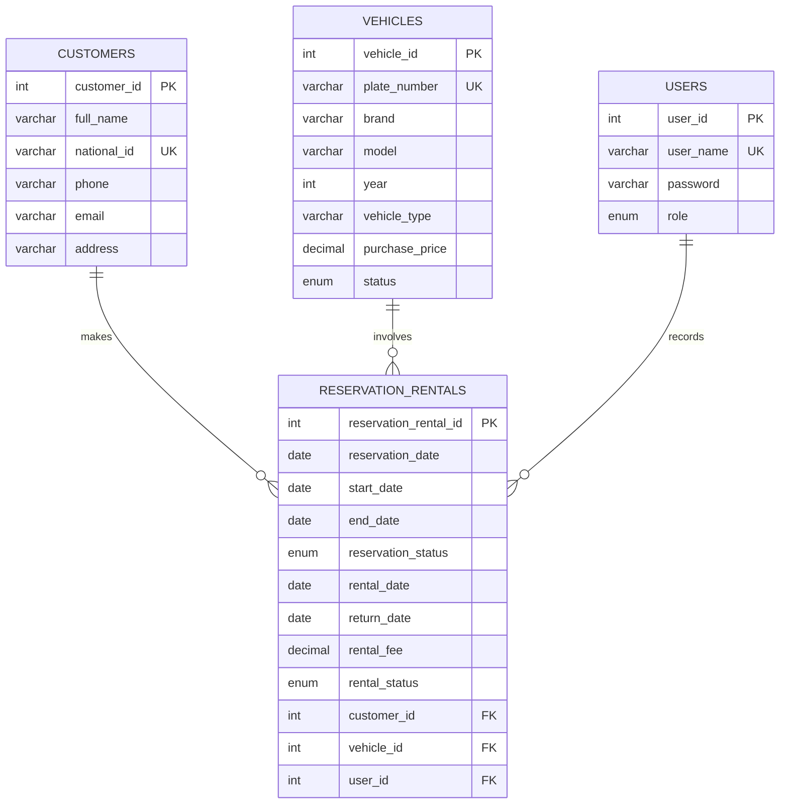
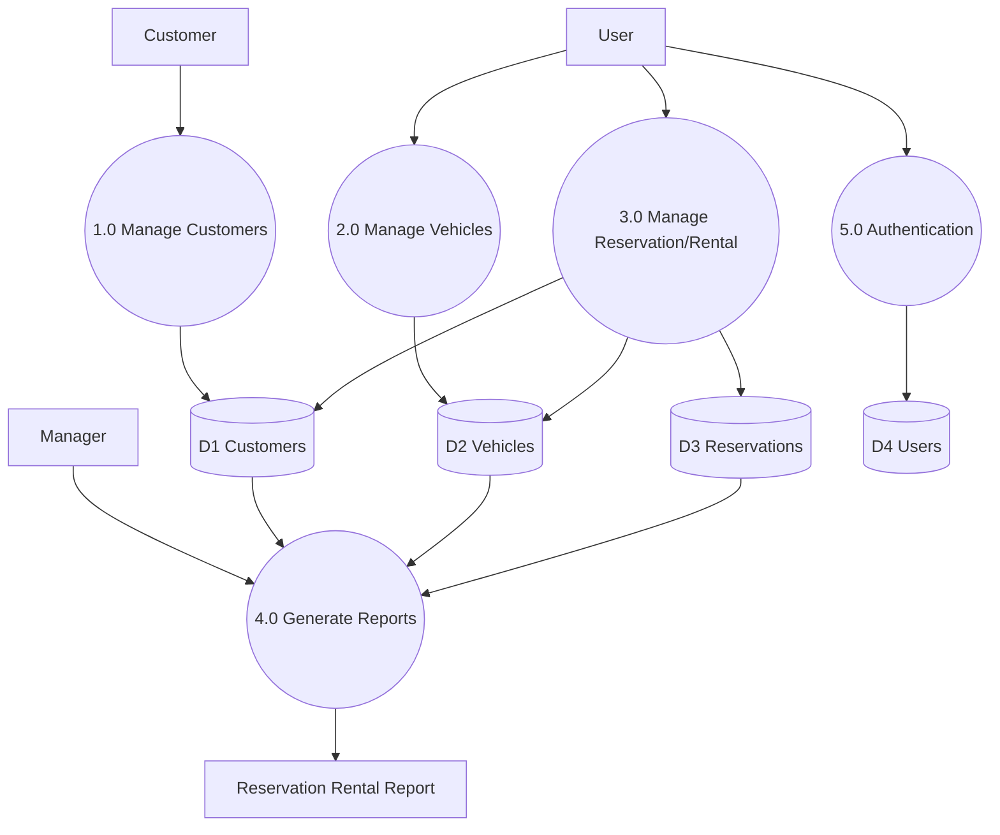

# Vehicle Rental and Reservation Subsystem (VRRS)

Web application for **SwitchWheels Enterprise** (Huye) to manage customers, fleet vehicles, reservations/rentals, and reporting.

## Stack

| Layer | Technology | Port |
|-------|------------|------|
| Frontend | React + Vite + Tailwind | **5180** |
| Backend | Express + Mongoose + express-session | **5560** |
| Database | MongoDB **VRRS** | — |

## Quick start

```bash
cd vrrs/backend && cp .env.example .env && npm install && npm run dev
cd vrrs/frontend && npm install && npm run dev
```

Open http://localhost:5180 — login: `admin` / `admin123`

## Features

| Feature | Implementation |
|---------|----------------|
| MongoDB database **VRRS** | `backend/config/db.js` |
| ERD with PK/FK | Below |
| Level 0 DFD | Below |
| CRUD + search | Customers, vehicles, reservations, users |
| Session login | Cookie `vrrs.sid`, `withCredentials` |
| Roles | admin, manager, staff |
| Report | `GET /api/reports/reservation-rental` |

---

## Entity Relationship Diagram (ERD)



### Relationships

1. **Customer (1) — (M) Reservation_Rental**
2. **Vehicle (1) — (M) Reservation_Rental**
3. **User (1) — (M) Reservation_Rental**

---

## Level 0 DFD

External entities: **Customer**, **User**, **Manager**

| Process | Data stores |
|---------|-------------|
| 1.0 Manage Customers | D1 Customers |
| 2.0 Manage Vehicles | D2 Vehicles |
| 3.0 Manage Reservation/Rental | D1, D2, D3 |
| 4.0 Generate Reports | D1, D2, D3 |
| 5.0 User Authentication | D4 Users |



---

## API

| Method | Endpoint |
|--------|----------|
| POST | `/api/auth/login` |
| POST | `/api/auth/logout` |
| GET | `/api/auth/me` |
| CRUD | `/api/customers`, `/api/vehicles`, `/api/reservations` |
| GET | `*/search?q=` |
| CRUD | `/api/users` (admin) |
| GET | `/api/reports/reservation-rental` (manager/admin) — full report |
| GET | `/api/reports?startDate=&endDate=` (manager/admin) — report by date |

---

## Project structure

```
vrrs/
├── README.md
├── backend/          ← MongoDB (database VRRS)
└── frontend/
```
